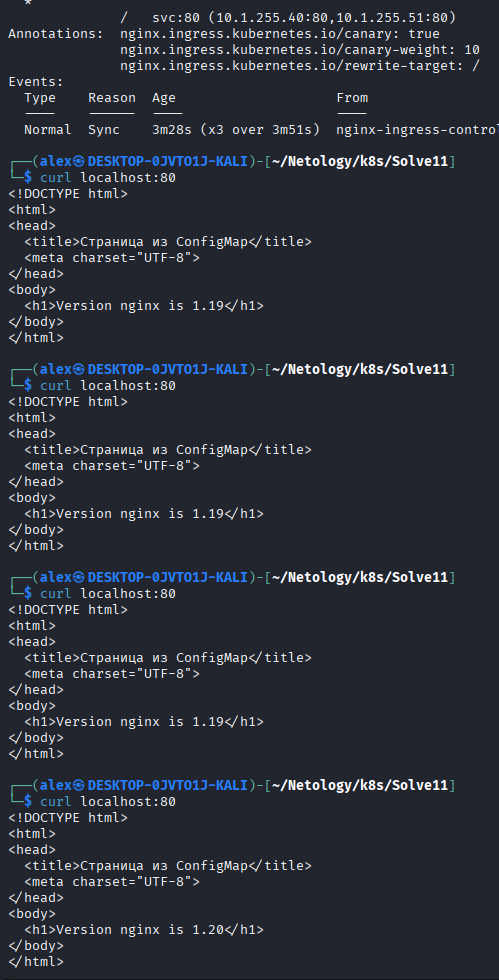

# Task 1

Так как ресурсы ограничены и новое приложение не умеет работать со старым, то наиболее подходящий способ обновления - recreate. Предположим мы выбрали Rolling update, что может произойти в этом случае? Может случиться так, что новая версия упадёт или появятся критические ошибки, то придётся откатываться на старую версию, но новая версия не может работать со старой и, возможна потеря данных.

# Task 2

