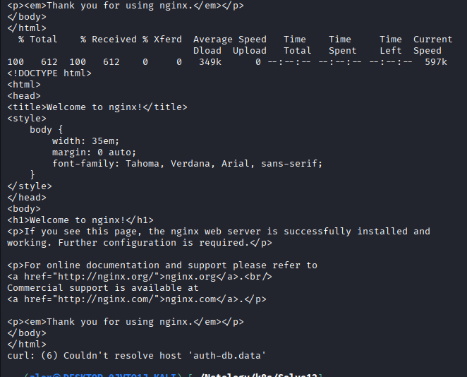

# Task 1

Для сетевого взаимодействия подов между различными пространствами имен FQDN нужно указывать как: ``` <service-name>.<namespace-name> ```. В нашем случае было указано, ``` curl auth-db ```, где auth-db - это имя сервиса в пространстве имён data. И, естественно, под не мог разрешить такое имя. После добавления ``` data ```, то есть ``` curl auth-db.data ```, curl проходит успешно, о чём говорят логи ``` kubectl logs deploy/web-consumer -c busybox -n web ```:



[apps.yaml fine](./apps.yaml)