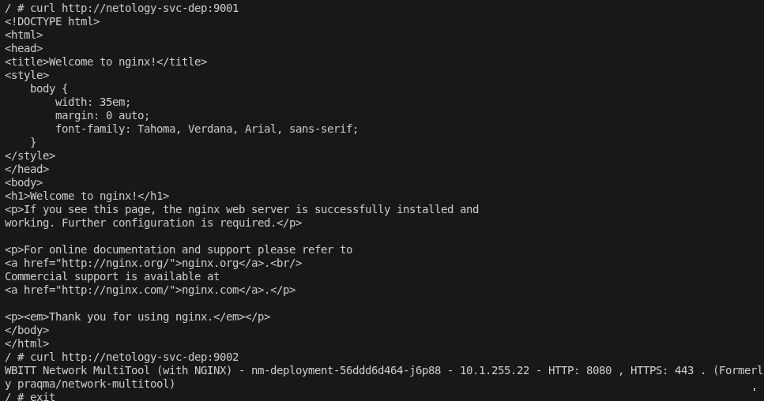
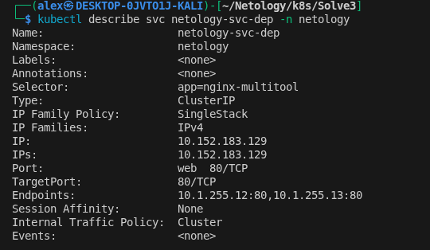
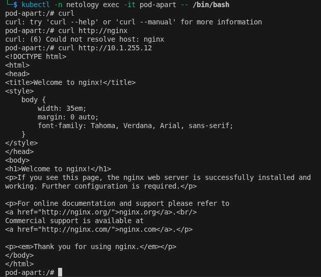
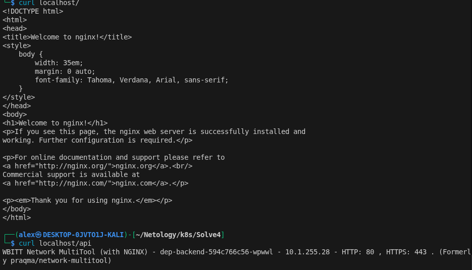

task 1 [deployment](./deployment.yaml)

task 1 [service](./service.yml)

task 1 [podApart](./pod.yml)

task 2 [deployment_w](./deployment_w.yml)

task 2 [service_w](./service_w.yml)

# Task 1
    

# Task 2
    

