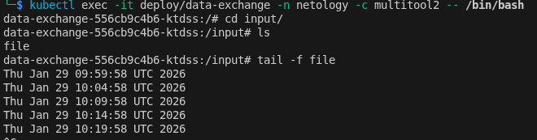
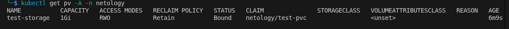
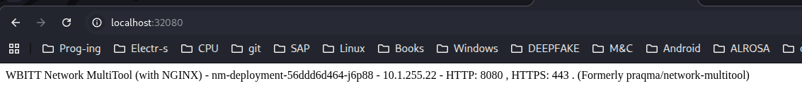
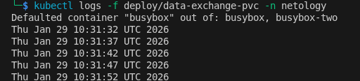

# Task 1

## Manifests:

[deployment](./deployment.yaml)

[service](./service.yml)

[service-node-port](./service-nodePort.yml)
    

# Task 2

## Manifests:

[deployment-frontend](./deployment-frontend.yaml)

[deployment-backend](./deployment-backend.yaml)

[service-frontend](./service-frontend.yml)

[service-backend](./service-backend.yml)

[ingress](./ingress.yml)

