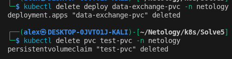
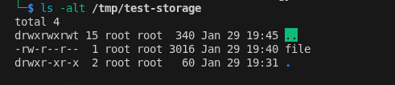
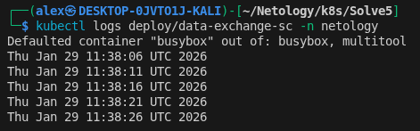

# Task 1

## Manifest:

[containers-data-exchange](./containers-data-exchange.yml)

## Pod describe:

```
└─$ kubectl describe pods data-exchange -n netology
Name:             data-exchange-556cb9c4b6-ktdss
Namespace:        netology
Priority:         0
Service Account:  default
Node:             desktop-0jvto1j-kali/10.8.1.5
Start Time:       Thu, 29 Jan 2026 18:59:56 +0900
Labels:           app=data-exchange-lable
                  pod-template-hash=556cb9c4b6
Annotations:      cni.projectcalico.org/containerID: 6e02eca81e438dd39289cfc5efc242a5800bd32762e53f82cff3a02e99f27a60
                  cni.projectcalico.org/podIP: 10.1.255.44/32
                  cni.projectcalico.org/podIPs: 10.1.255.44/32
Status:           Running
IP:               10.1.255.44
IPs:
  IP:           10.1.255.44
Controlled By:  ReplicaSet/data-exchange-556cb9c4b6
Containers:
  busybox:
    Container ID:  containerd://8a53373793bc35983dbfdd84934dce10a31a2960538207b98a8fe4aab1acb5c1
    Image:         busybox
    Image ID:      docker.io/library/busybox@sha256:e226d6308690dbe282443c8c7e57365c96b5228f0fe7f40731b5d84d37a06839
    Port:          <none>
    Host Port:     <none>
    Command:
      /bin/sh
      -c
    Args:
      while :; do echo $(date) | tee -a /output/file; sleep 300; done
    State:          Running
      Started:      Thu, 29 Jan 2026 18:59:58 +0900
    Ready:          True
    Restart Count:  0
    Environment:    <none>
    Mounts:
      /output from vol (rw)
      /var/run/secrets/kubernetes.io/serviceaccount from kube-api-access-894gh (ro)
  multitool2:
    Container ID:  containerd://b7355572d809201cceaa684e419e7fff7c5580157cc9a98c16fe111eb50a04b4
    Image:         wbitt/network-multitool
    Image ID:      docker.io/wbitt/network-multitool@sha256:db2810fe2c8d36db074eab5d98fbf861c8ed55e0786d648d3477b3de9135632e
    Port:          80/TCP
    Host Port:     0/TCP
    Command:
      /bin/sh
      -c
    Args:
      tail -f /input/file
    State:          Running
      Started:      Thu, 29 Jan 2026 19:00:00 +0900
    Ready:          True
    Restart Count:  0
    Environment:    <none>
    Mounts:
      /input from vol (rw)
      /var/run/secrets/kubernetes.io/serviceaccount from kube-api-access-894gh (ro)
Conditions:
  Type                        Status
  PodReadyToStartContainers   True 
  Initialized                 True 
  Ready                       True 
  ContainersReady             True 
  PodScheduled                True 
Volumes:
  vol:
    Type:       EmptyDir (a temporary directory that shares a pod's lifetime)
    Medium:     
    SizeLimit:  <unset>
  kube-api-access-894gh:
    Type:                    Projected (a volume that contains injected data from multiple sources)
    TokenExpirationSeconds:  3607
    ConfigMapName:           kube-root-ca.crt
    ConfigMapOptional:       <nil>
    DownwardAPI:             true
QoS Class:                   BestEffort
Node-Selectors:              <none>
Tolerations:                 node.kubernetes.io/not-ready:NoExecute op=Exists for 300s
                             node.kubernetes.io/unreachable:NoExecute op=Exists for 300s
Events:                      <none>

```
    


# Task 2

## Manifest:

[pv-pvc](./pv-pvc.yml)





После удаления Deployment и PVC статус PV стал "released", до этого был "bound". Это говорит о том, что ранее объём был подключён к пода, но после был отвязан от всего и ждёт, когда подключат снова.




После удаления хранилища, файл остался, так как в настройках хранилища указано: retain, что говорит о том, что файл нужно оставить после снесения хранилища.

# Task 3

## Manifest:

[app-sc](./app-sc.yml)

[sc-pvc](./sc-pvc.yml)

[sc-pv](./sc-pv.yml)





