# Task 1
## Create:


## templates: 

```
└─$ helm template template-app .        
---
# Source: nginx-app/templates/configmap-web.yml
apiVersion: v1
kind: ConfigMap
metadata:
  name: nginx-config 
  namespace: netology
data:
  index.html: |
    <!DOCTYPE html>
    <html>
    <head>
      <title>Страница из ConfigMap</title> 
      <meta charset="UTF-8">
    </head>
    <body>
      <h1>Привет от Kubernetes! namespace is netology</h1> 
      <h1>Version nginx is 1.14.2</h1> 
    </body>
    </html>
---
# Source: nginx-app/templates/service.yml
apiVersion: v1
kind: Service
metadata:
  name: svc-frontend
  namespace: netology
spec:
  ports:
    - name: web-frontend
      port: 80
      protocol: TCP
      targetPort: 80
  selector:
    app: nginx-app
---
# Source: nginx-app/templates/deployment.yml
apiVersion: apps/v1
kind: Deployment
metadata:
  name: web-app
  labels:
    app:  nginx-app
  namespace: netology
spec:
  replicas: 1
  selector:
    matchLabels:
      app:  nginx-app
  template:
    metadata:
      labels:
        app:  nginx-app
    spec:
      containers:
      - name: nginx
        image: nginx:1.14.2
        ports:
          - containerPort: 80
        volumeMounts:
          - name: nginx-config  
            mountPath: /usr/share/nginx/html/
      volumes:
      - name: nginx-config
        configMap:
          name: nginx-config
---
# Source: nginx-app/templates/ingress.yml
apiVersion: networking.k8s.io/v1
kind: Ingress
metadata:
  name: tst-ingress
  annotations:  
    
  namespace: netology
spec:
  rules:
  - http:
      paths:
      - path: /
        pathType: Prefix
        backend:
          service:
            name: svc-frontend
            port:
              number: 80
```

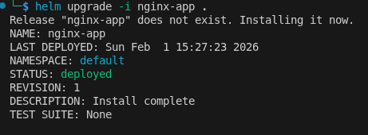

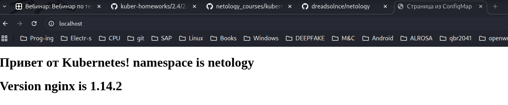

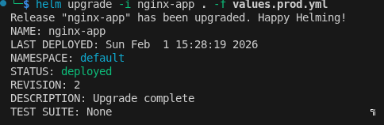

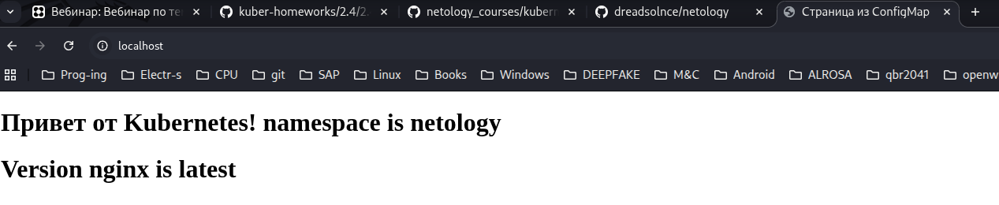

# Task 2

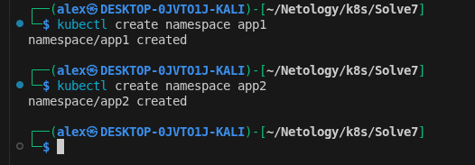

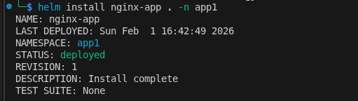

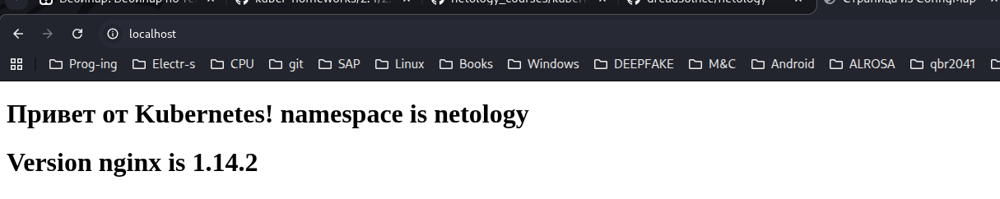

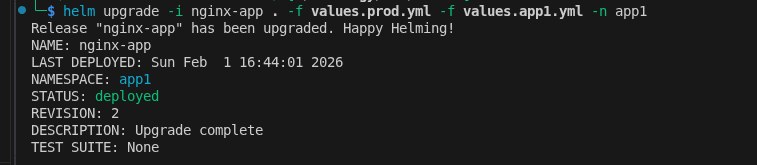

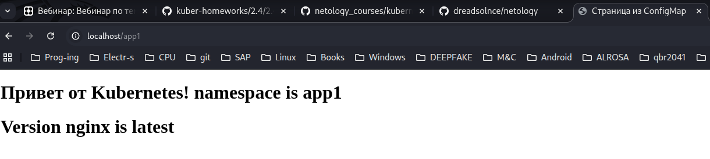

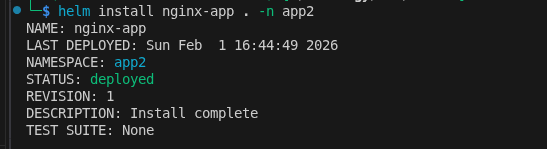

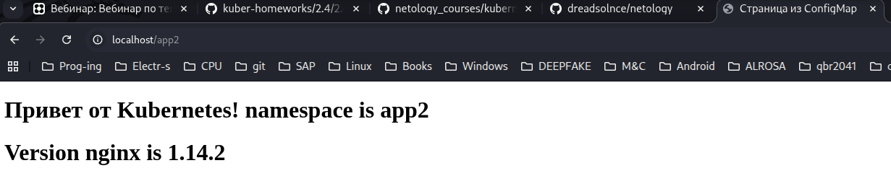


